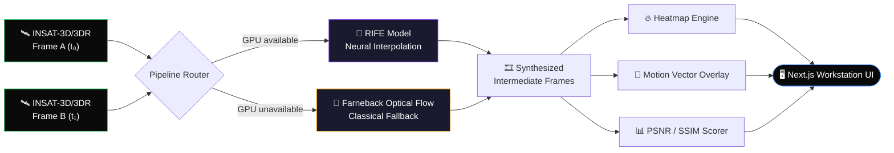

<div align="center">

# 🛰️ SATFLOW AI

### Synthesizing Time Itself Between Satellite Passes

**AI-powered temporal super-resolution for geostationary satellite imagery — turning sparse 30-minute INSAT-3D/3DR passes into a continuous, real-time weather feed.**

[](#)
[](#-the-team)
[](#)

[](#)
[](#)
[](#)
[](#)
[](#)
[](#)

<br/>

```
╔═══════════════════════════════════════════════════════════════╗
║   FRAME(t₀) ──────────[ DENSE OPTICAL FLOW ]──────────► ?      ║
║       ▼                                                  ▼     ║
║   ░░░░░░░░         RIFE Neural Interpolation        ░░░░░░░░   ║
║   ░ CLOUD ░  ───►   t = 0.2 · 0.4 · 0.6 · 0.8  ───►  ░ CLOUD ░ ║
║   ░░░░░░░░         Synthetic Intermediate Frames     ░░░░░░░░   ║
║       ▲                                                  ▲     ║
║   FRAME(t₁) ◄─────── 30 MIN GAP → 6 MIN GAP ─────────────┘     ║
╚═══════════════════════════════════════════════════════════════╝
```

</div>

<br/>

## 📡 The Problem

Geostationary satellites like **INSAT-3D/3DR** image the same patch of Earth roughly every **30 minutes**. For slow-moving phenomena that's plenty — but **cyclones, flash floods, convective storm cells, and wildfire plumes** can change dramatically in a fraction of that window. Agencies are left choosing between expensive new payloads or watching disasters unfold in 30-minute jumps.

**SATFLOW AI closes that gap computationally.** Instead of launching more satellites, we use deep-learning frame interpolation to *synthesize* the missing moments in between — turning a stuttering slideshow into a smooth, near-continuous monitoring feed.

<br/>

## 🧭 Table of Contents

| | | |
|---|---|---|
| [✨ Features](#-key-features) | [🏗️ Architecture](#️-system-architecture) | [🎨 UI Philosophy](#-design-philosophy) |
| [🧰 Tech Stack](#-tech-stack) | [📂 Project Structure](#-project-structure) | [⚙️ Setup](#️-installation--setup) |
| [🔌 API Reference](#-api-reference) | [📊 Benchmarks](#-quality-benchmarks) | [👥 Team](#-the-team) |
| [🚀 Deployment](#-production-deployment) | [🗺️ Roadmap](#️-roadmap) | [📜 License](#-license) |

<br/>

## ✨ Key Features

<table>
<tr>
<td width="33%" valign="top">

### 🧠 AI Frame Interpolation
Pre-trained **RIFE** (Real-Time Intermediate Flow Estimation) generates 1, 3, or 5 physically-plausible intermediate frames at arbitrary timesteps `t ∈ (0,1)` — no hand-tuned heuristics, just learned motion.

</td>
<td width="33%" valign="top">

### 🛟 Classical Fallback
A **Farneback dense optical-flow** warping engine kicks in automatically the moment RIFE weights are missing or CUDA isn't available — the pipeline never goes dark.

</td>
<td width="33%" valign="top">

### 🎯 Motion Vector Overlays
Dense flow fields are rendered as directional arrows, surfacing **cloud velocity** and **storm rotation** at a glance.

</td>
</tr>
<tr>
<td width="33%" valign="top">

### 🔥 Change Intensity Heatmaps
Differential colormaps highlight **shifting cyclone eyes**, **expanding flood boundaries**, and **growing fire plumes** between frames.

</td>
<td width="33%" valign="top">

### 🖥️ Interactive Workstation
Drag-to-compare before/after slider, 1×–3× zoom, scrubbable timeline playback, and live **PSNR / SSIM** quality readouts.

</td>
<td width="33%" valign="top">

### 📊 Quantified Trust
Every synthesized frame ships with objective fidelity metrics, so analysts know exactly how much to trust what they're seeing.

</td>
</tr>
</table>

<br/>

## 🎨 Design Philosophy

> *Mission control, not a dashboard template.*

The frontend is handcrafted to feel like a live satellite ops console — drawing visual language from Stripe, Linear, and Vercel rather than generic admin-panel kits.

| Element | Detail |
|---|---|
| 🖤 **Canvas** | Uniform `#000000` pitch-black base, layered with a faint tech-grid and film-grain noise so glassmorphic panels glow with maximum contrast |
| 📡 **Telemetry Widget** | Floating bottom-left HUD polling `GET /health` live — shows API connectivity, GPU/CUDA status, and the active interpolation engine in real time |
| 🍱 **Asymmetric Bento Grid** | Hazard categories (Cyclones, Floods, Convective Storms, Cloud Layers, Wildfires) laid out as organic, responsive bento cards with monospace metadata |
| 👥 **Radar HUD Avatars** | Team cards animate grayscale → color on hover, ringed by a slowly rotating dashed HUD ring simulating a radar sweep |
| 🗺️ **Numbered Roadmap** | A 3-column `01 · 02 · 03` pipeline walkthrough of the implementation and ISRO deployment path |

<br/>

## 🏗️ System Architecture



<br/>

## 🧰 Tech Stack

<table>
<tr><th>Layer</th><th>Technology</th></tr>
<tr><td><b>Frontend</b></td><td>Next.js 15 (App Router), TypeScript, Tailwind CSS</td></tr>
<tr><td><b>Backend</b></td><td>FastAPI, Python 3.9–3.11, Uvicorn</td></tr>
<tr><td><b>AI / CV Engine</b></td><td>PyTorch, RIFE (ECCV 2022), OpenCV (Farneback flow), NumPy, Pillow</td></tr>
<tr><td><b>Hosting</b></td><td>Vercel (frontend) · Render (FastAPI service) · AWS EC2 / RunPod (GPU inference)</td></tr>
</table>

<br/>

## 📂 Project Structure

<details>
<summary><b>Click to expand full repository tree</b></summary>

```
satflow-ai/
│
├── DEPLOYMENT.md              # Step-by-step production hosting guide (Vercel & Render)
├── README.md                  # You are here
│
├── frontend/
│   ├── app/                   # Next.js 15 App Router (landing, dashboard, architecture, about)
│   ├── components/            # Globe, Compare Slider, Timeline, Telemetry Widget
│   ├── public/                # Static assets (team photos, favicons)
│   ├── package.json
│   ├── tsconfig.json
│   └── tailwind.config.ts
│
├── backend/
│   ├── app/
│   │   ├── main.py            # FastAPI initializer & CORS config
│   │   ├── config.py          # Path management & defaults
│   │   ├── routes/            # generate / metrics / health endpoints
│   │   ├── services/          # rife_inference, optical_flow, metrics, heatmap
│   │   └── utils/             # image_loader, preprocessing, file_handler
│   ├── model/
│   │   └── rife/               # ECCV2022-RIFE model repository
│   ├── outputs/                # Static-mounted rendered output directory
│   ├── sample_data/             # Synthetic cyclone frame pairs (cloud_A / cloud_B)
│   ├── requirements.txt
│   ├── run.py                  # Server entrypoint
│   └── test_backend.py         # Independent validation suite
```

</details>

<br/>

## ⚙️ Installation & Setup

### Prerequisites

| Requirement | Version |
|---|---|
| 🐍 Python | 3.9 – 3.11 |
| 🟩 Node.js | 18.0+ |
| 🔧 Git | Latest |

### 1️⃣ Backend

```bash
cd backend
pip install -r requirements.txt
```

> RIFE weights (`flownet.pkl`) auto-download to `model/rife/train_log/` on first run if missing.

```bash
python test_backend.py   # all cases should print [OK]
python run.py             # → http://localhost:8000  (docs at /docs)
```

### 2️⃣ Frontend

```bash
cd ../frontend
npm install
npm run dev               # → http://localhost:3000
```

<br/>

## 🔌 API Reference

| Endpoint | Method | Purpose |
|---|---|---|
| `/health` | `GET` | API connectivity, GPU/CUDA status, active engine |
| `/generate` | `POST` | Submit frame pair → returns interpolated intermediate frames |
| `/metrics` | `GET` | PSNR / SSIM quality scores for the last generation |

Full interactive OpenAPI docs are available at **`http://localhost:8000/docs`** once the backend is running.

<br/>

## 📊 Quality Benchmarks

| Metric | What it measures | Target |
|---|---|---|
| **SSIM** | Structural similarity between synthesized and ground-truth frames | `> 0.90` |
| **PSNR** | Pixel-level reconstruction fidelity (dB) | `> 30 dB` |
| **Inference Latency** | Time per interpolated frame (GPU) | `< 200ms` |

<br/>

## 🗺️ Roadmap

<table>
<tr>
<td align="center" width="33%">

### `01`
**Core Engine**
RIFE + Farneback dual-pipeline, FastAPI service, baseline accuracy validation

</td>
<td align="center" width="33%">

### `02`
**Mission Console**
Bento dashboard, telemetry widget, motion overlays, heatmap generation

</td>
<td align="center" width="33%">

### `03`
**ISRO Integration**
Live INSAT-3D/3DR data ingestion, GPU autoscaling, disaster-agency API access

</td>
</tr>
</table>

<br/>

## 👥 The Team — **ByteBots**

<table>
<tr><th>Name</th><th>Role</th></tr>
<tr><td><b>Harsh Shirke</b></td><td>Team Leader & AI Lead</td></tr>
<tr><td><b>Devansh Pandey</b></td><td>Architect</td></tr>
<tr><td><b>Deepa Choudhary</b></td><td>Computer Vision Research</td></tr>
<tr><td><b>Aditi Deshmukh</b></td><td>Meteorological Analyst</td></tr>
</table>

<br/>

## 🚀 Production Deployment

Full hosting walkthrough — Vercel for the frontend, FastAPI on Render (CPU fallback), and GPU node configuration on AWS EC2 / RunPod for CUDA acceleration — lives in **[`DEPLOYMENT.md`](./DEPLOYMENT.md)**.

<br/>

## 📜 License

Built for the **Bhartiya Antariksh Hackathon**, in service of disaster mitigation agencies monitoring India's skies. Licensing details TBD by the ByteBots team.

<br/>

<div align="center">

**Made with 🛰️, ☕, and way too many optical flow papers — Team ByteBots**

</div>
