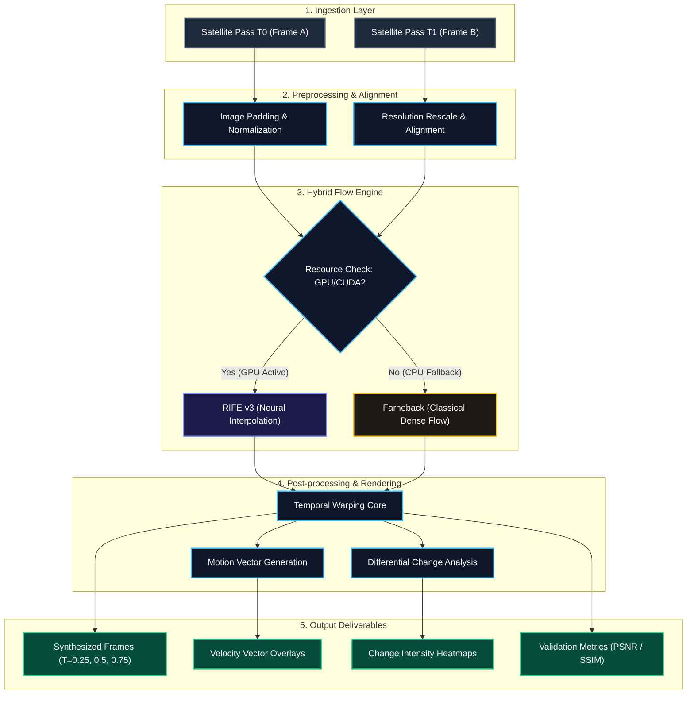
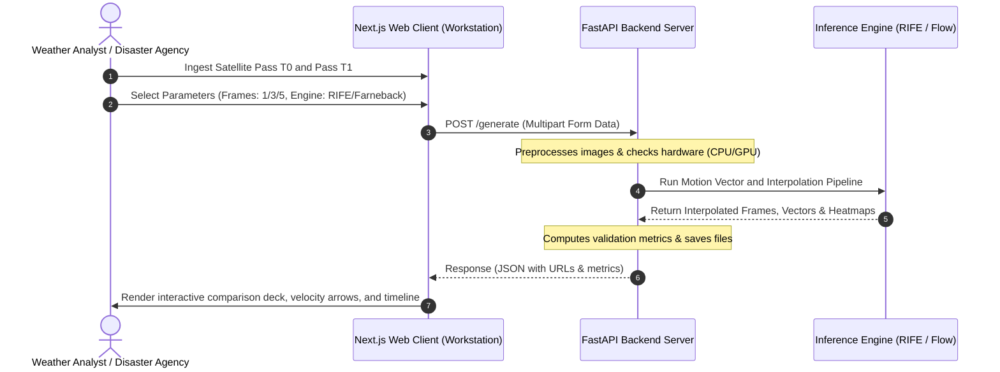

# 🛰️ SATFLOW AI – Presentation Slide Content

This document contains slide-by-slide content ready to be copied directly into your PowerPoint / Google Slides presentation for the **ISRO Bharatiya Antariksh Hackathon**.

---

## 🛝 Slide 1: Opportunity & USP

### ❓ How is it different from existing ideas?
*   **Linear Blending vs. Deep Flow**: Traditional interpolation simply blends pixel opacities, which creates unrealistic "ghosting" or "blurring" of moving cloud layers. SATFLOW AI uses **RIFE v3 (Real-Time Intermediate Flow Estimation)** to dynamically predict pixel movements.
*   **Classical Fallback Safeguard**: Most AI models fail or crash if GPU memory is unavailable. SATFLOW features a hybrid pipeline that automatically switches to an optimized **Farneback Classical Flow** baseline, guaranteeing 100% operational availability on any server.
*   **Not Just Imagery, but Analytics**: Standard image smoothers only make videos. SATFLOW generates **meteorological analytics**—dense cloud velocity vectors and change-intensity heatmaps—directly from the flow fields.

### 🎯 How will it solve the problem?
*   **Temporal Gap Mitigation**: Geostationary satellites (INSAT-3D/3DR) capture observations every 15 to 30 minutes. Rapid weather events (thunderstorms, cyclogenesis) can develop in between passes.
*   **Virtual Super-Resolution**: SATFLOW synthesizes 1, 3, or 5 physically accurate intermediate frames ($t \in (0, 1)$), transforming a sparse 30-minute interval into a continuous **5-minute stream**.
*   **Zero-Hardware Capital Expenditure**: Enhances tracking capabilities entirely in software, saving millions of dollars required to build, launch, and operate additional physical satellite payloads.

### 💎 USP (Unique Selling Proposition)
1.  **Hybrid Flow Architecture**: Combines deep-learning neural flow (precision) with classical fluid-warping algorithms (robustness) in a single pipeline.
2.  **Visual Change Tracking**: Automated generation of change-intensity heatmaps that outline expanding flood zones, storm center displacement, and active wildfire plumes.
3.  **Active Telemetry link**: Seamless dashboard integration showing live GPU/CPU resource load, server connection, and inference model states.

---

## 🛝 Slide 2: Technical Architecture Diagram

*Copy and paste the Mermaid code below into [Mermaid Live](https://mermaid.live) to generate a professional diagram image.*

---

## 🛝 Slide 3: List of Features Offered

*   **⚡ Arbitrary Frame Synthesis**: Generate 1, 3, or 5 intermediate satellite frames to increase effective temporal resolution.
*   **🌪️ Cloud Velocity Vectoring**: Computes dense optical flow arrows to track cyclonic rotation speeds, wind direction, and weather fronts.
*   **🔥 Change-Intensity Heatmaps**: Color-coded differential maps highlighting the rate of change in cyclones, flood expansion, and fire plume propagation.
*   **🛡️ Dynamic Dual-Engine Core**: Automatic fallback from RIFE Neural Net (GPU) to OpenCV Farneback (CPU) to ensure zero server downtime.
*   **🛰️ Real-Time Telemetry Link**: Dashboard widget displays active server status, GPU/CPU usage, active model, and network logs.
*   **🔬 Scientific Validation Deck**: Integrated metrics calculator displaying Peak Signal-to-Noise Ratio (PSNR) and Structural Similarity Index (SSIM) between predictions and ground truths.
*   **📱 Fully Responsive Workstation**: Mobile-responsive Bento layout supporting side-by-side comparison swipe-slider, zoom ($1\times$ to $3\times$), and playback timeline.

---

## 🛝 Slide 4: Process Flow & Use-Case Diagram

---

## 🛝 Slide 5: Workstation Wireframes & Mock Screens

*(The mockup image is saved in your root directory as [satflow_workspace_mockup.png](file:///d:/ISRO%20HACKATHON/satflow_workspace_mockup.png). Copy and insert it directly into this slide!)*

Our workstation UI is designed around **5 primary interaction nodes** to maximize analyst productivity:

1.  **Mission Control Console (Workstation)**:
    *   **Left Column**: Control deck containing drag-and-drop slots for T0/T1 observations, frame density toggles (1, 3, 5), and engine selectors.
    *   **Right Column**: Swipe-Slider deck with pixel-level inspection zoom ($1\times$, $2\times$, $3\times$) for side-by-side cyclone core verification.
2.  **Telemetry Widget (Link monitor)**:
    *   Floating status hub in the bottom-left. Monitor active server address, active system state, hardware architecture (CUDA vs CPU), and engine selection.
3.  **Hazard Bento Grid (Landing Showcase)**:
    *   Asymmetrical card structure detailing target ISRO use-cases: Cyclone trajectories, flood propagation, thunderstorm fronts, convective cloud vectors, and active wildfires.
4.  **Flowchart Architecture view**:
    *   Interactive pipeline visualization mapping frontend operations directly to underlying mathematical routing modules.
5.  **Interactive Timeline Controller**:
    *   Playback deck with Play, Pause, Step-Forward, Step-Backward, and speed loop controls to simulate fluid cyclone movements.

---

## 🔗 Slide Placement Strategy for Live Demo Link

### 2. 🛝 Slide 5: Mock Screens & Wireframes Slide (Central Callout)
*   **Purpose**: Serves as the trigger visual during your transition from slides to the live screen-share walkthrough.
*   **Copy-Paste Template**:
    *   🚀 **Launch Live Prototype** ➔ https://satflowai.vercel.app

### 3. 🛝 Slide 6: Thank You / Q&A Slide (Center Screen)
*   **Purpose**: Remains visible on the screen during the entire 5-10 minute Q&A panel so judges can note the URL.
*   **Copy-Paste Template**:
    *   **Thank You!**
    *   *ByteBots Team*
    *   🌐 **Workstation URL**: https://satflowai.vercel.app
    *   📂 **Source Code**: https://github.com/harshshirke66/SATFLOW-AI

